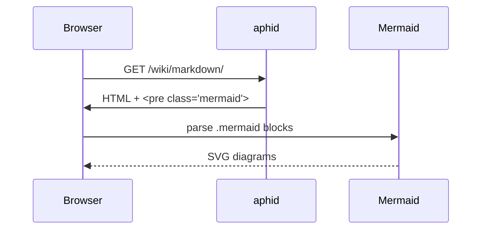

aphid 0.1.1 is a small follow-up to [[v0-1]], focused on the markdown pipeline. The headline adds are **Mermaid diagrams** rendered client-side and **GitHub-style alert blocks**. Both are things I wanted while writing the docs you're reading.

# Mermaid diagrams

Fenced blocks tagged `mermaid` are now rendered as live diagrams in the browser. Source goes in, SVG comes out:

````markdown

````

Renders as:


A few notes on how it's wired:

- The Mermaid runtime is **vendored with aphid** — no CDN, no third-party request at page load. The bundle ships inside the binary and is written out next to the rest of the theme's static files.
- The `<script>` only loads on pages that actually contain a mermaid block. Index pages, posts without diagrams, and the 404 page all stay clean.
- The build pipeline emits each block as `<pre class="mermaid">…source…</pre>`, so if JavaScript is disabled the reader still sees the original diagram source rather than a blank space.
- Flowcharts, sequence diagrams, class diagrams, state diagrams, gantt charts, ER diagrams, mindmaps, gitgraphs — anything Mermaid supports works. See [[markdown]] for the syntax pointer.

# Markdown alerts

The five GitHub-flavoured alert types are recognised at parse time:

```markdown
> [!NOTE]
> Highlights information that users should take into account, even when skimming.

> [!TIP]
> Optional information to help a user be more successful.

> [!IMPORTANT]
> Crucial information necessary for users to succeed.

> [!WARNING]
> Critical content demanding immediate user attention due to potential risks.

> [!CAUTION]
> Negative potential consequences of an action.
```

Rendered:

> [!NOTE]
> Highlights information that users should take into account, even when skimming.

> [!TIP]
> Optional information to help a user be more successful.

> [!IMPORTANT]
> Crucial information necessary for users to succeed.

> [!WARNING]
> Critical content demanding immediate user attention due to potential risks.

> [!CAUTION]
> Negative potential consequences of an action.

Each alert is emitted as `<div class="markdown-alert markdown-alert-{type}">`, so themes can style the five types independently. Plain blockquotes (`>` without a `[!TYPE]` marker) are untouched — there's no behavioural change to existing content.

# Also in 0.1.1

A handful of smaller things landed alongside the two headline features:

- **Smart punctuation.** Straight quotes are converted to curly quotes, `--` to en-dashes, `---` to em-dashes, and `...` to ellipses, all at parse time. Just write natural prose.
- **Favicon generation.** Point `favicon` in `aphid.toml` at a single source image and aphid emits the full set of platform icons plus the matching `<link>` tags injected into every page's `<head>`. See [[configuration]].
- **`robots.txt` and `sitemap.xml`.** Both are generated automatically at the site root.

# Upgrading

```sh
cargo install aphid --locked --force
aphid --version
```

There are no breaking changes from 0.1.0 — alerts, mermaid, and smart punctuation are all additive at the markdown layer, and existing content renders identically unless it contained a literal ` ```mermaid ` block, a `> [!TYPE]` blockquote, or relied on raw `--` / `...` in prose.
