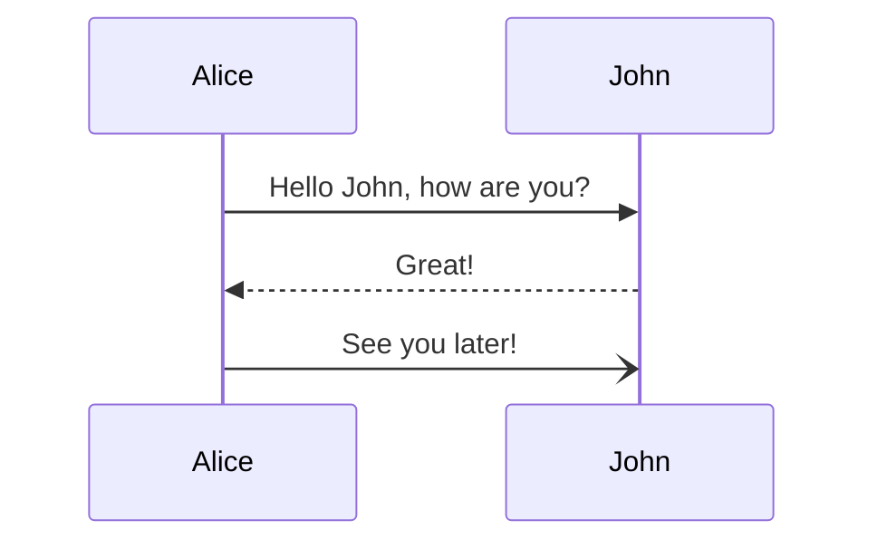

aphid uses [pulldown-cmark](https://github.com/raphlinus/pulldown-cmark) to render Markdown, with a small set of extensions enabled on top of standard [CommonMark](https://commonmark.org/).

# Standard elements

These work out of the box:

| Element | Syntax |
|---------|--------|
| Paragraph | Plain text separated by blank lines |
| **Bold** | `**text**` or `__text__` |
| *Italic* | `*text*` or `_text_` |
| `Inline code` | `` `code` `` |
| [Link](https://example.com) | `[text](url)` |
| Image | `` |
| Blockquote | `> text` |
| Unordered list | `- item` or `* item` |
| Ordered list | `1. item` |
| Horizontal rule | `---` |
| Hard line break | Two trailing spaces |

# Headings

Headings are written with `#` markers. Because the page title is rendered as `<h1>` by the template, the markdown pipeline shifts all heading levels up by one — so `#` becomes `<h2>`, `##` becomes `<h3>`, and so on. Levels are capped at `<h6>`.

Every heading automatically receives a slug-based `id` attribute for anchor links, and is included in the table of contents passed to the template.

```markdown
# Top-level section    → <h2 id="top-level-section">
## Subsection          → <h3 id="subsection">
```

When two headings on the same page produce the same slug (e.g. two `# Examples` sections), the second gets `-2`, the third `-3`, and so on, so anchor links remain unique.

# Code blocks

Fenced code blocks are syntax-highlighted using [syntect](https://github.com/trishume/syntect). The highlighter emits CSS classes (prefixed `hl-`) rather than inline styles, so syntax colors are fully controlled by the theme stylesheet. The default theme uses [Catppuccin Mocha](https://catppuccin.com/) colors. Specify a language identifier after the opening fence:

````markdown
```rust
fn main() {
    println!("Hello, world!");
}
```
````

Here is a rendered example:

```rust
use std::collections::HashMap;

/// A page in the site, parameterised by its frontmatter type.
pub struct Page<F> {
    pub slug: String,
    pub body: String,
    pub frontmatter: F,
}

fn process(pages: &[Page<BlogFrontmatter>]) -> HashMap<String, String> {
    let mut output = HashMap::new();
    for page in pages {
        let html = render(&page.body);
        output.insert(page.slug.clone(), html);
    }
    output
}
```

If the language is omitted or unrecognised, the block is rendered without highlighting. The built-in syntax set covers most common languages including Rust, Python, JavaScript, TypeScript, Go, C, C++, Shell, TOML, YAML, JSON, HTML, CSS, Dockerfile, and many more.

## Mermaid diagrams

Fenced blocks tagged `mermaid` are rendered as live diagrams in the browser using [Mermaid](https://mermaid.js.org/). The build pipeline emits the source as a `<pre class="mermaid">` element and the Mermaid runtime converts it to SVG client-side once the page loads:

````markdown

````

Renders as:


Mermaid supports flowcharts, sequence diagrams, class diagrams, state diagrams, gantt charts, mindmaps, and more — see the upstream [syntax reference](https://mermaid.js.org/intro/) for what's available.

The Mermaid runtime is vendored with aphid (no CDN) and only loaded on pages that contain at least one mermaid block, so unrelated pages don't pay the bundle cost. If JavaScript is disabled, the original diagram source is shown as preformatted text.

# External links

Links whose URL starts with `http://` or `https://` are rewritten to open in a new tab and carry `rel="noopener noreferrer"`:

```markdown
[example](https://example.com)
```

renders as:

```html
<a href="https://example.com" target="_blank" rel="noopener noreferrer">example</a>
```

Relative links, fragment links (`#section`), and other schemes (`mailto:`, `tel:`, …) are left untouched. [[wiki-links]] are always treated as internal.

# Images and static files

Images use standard markdown syntax: ``. For local assets, place files under your `static_dir` (default `static/`) and reference them with an absolute path:

```markdown

```

Here is a rendered example using an image from the wiki's static directory:


The build step copies `static_dir` into the output's `static/` directory, so the same path works in both serve and build modes. Theme static files are merged into the same `/static/` namespace — see [[themes]] for precedence rules.

# Extensions

## Tables

```markdown
| Column A | Column B |
|----------|----------|
| cell     | cell     |
```

## Strikethrough

```markdown
~~deleted text~~
```

## Task lists

```markdown
- [x] Done
- [ ] Not done
```

## Footnotes

```markdown
Some text with a footnote.[^1]

[^1]: The footnote content.
```

## Wiki-links

Cross-links to any other page by filename stem:

```markdown
[[page-slug]]
[[page-slug|Display text]]
```

See [[wiki-links]] for full details.

## Alerts

GitHub-style alert blocks highlight important information. Five types are supported:

```markdown
> [!NOTE]
> Highlights information that users should take into account, even when skimming.

> [!TIP]
> Optional information to help a user be more successful.

> [!IMPORTANT]
> Crucial information necessary for users to succeed.

> [!WARNING]
> Critical content demanding immediate user attention due to potential risks.

> [!CAUTION]
> Negative potential consequences of an action.
```

Here are rendered examples:

> [!NOTE]
> Highlights information that users should take into account, even when skimming.

> [!TIP]
> Optional information to help a user be more successful.

> [!IMPORTANT]
> Crucial information necessary for users to succeed.

> [!WARNING]
> Critical content demanding immediate user attention due to potential risks.

> [!CAUTION]
> Negative potential consequences of an action.

Alerts are rendered as `<div class="markdown-alert markdown-alert-{type}">` elements with a title paragraph, so themes can style each type independently. Regular blockquotes (`>` without a `[!TYPE]` marker) are unaffected.

## Smart punctuation

ASCII punctuation is automatically replaced with typographically correct Unicode characters during rendering:

| Input | Output | Description |
|-------|--------|-------------|
| `"quote"` | “quote” | Curly double quotes |
| `'quote'` | ‘quote’ | Curly single quotes |
| `--` | – | En dash |
| `---` | — | Em dash |
| `...` | … | Ellipsis |

This happens at parse time and requires no special syntax — just write natural prose and the output will use proper typographic characters.

# Not supported

The following are not enabled:

- Math (`$...$` / `$$...$$`)
- Custom heading ID syntax (`# Heading {#custom-id}`) — IDs are auto-generated from the heading text
