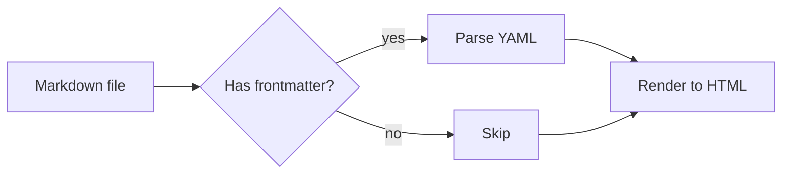
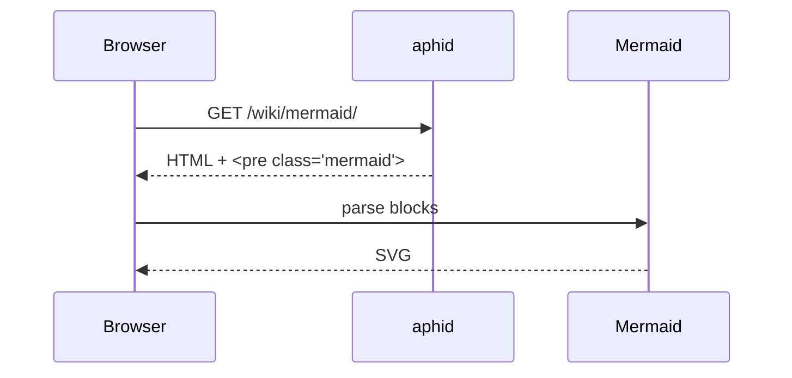
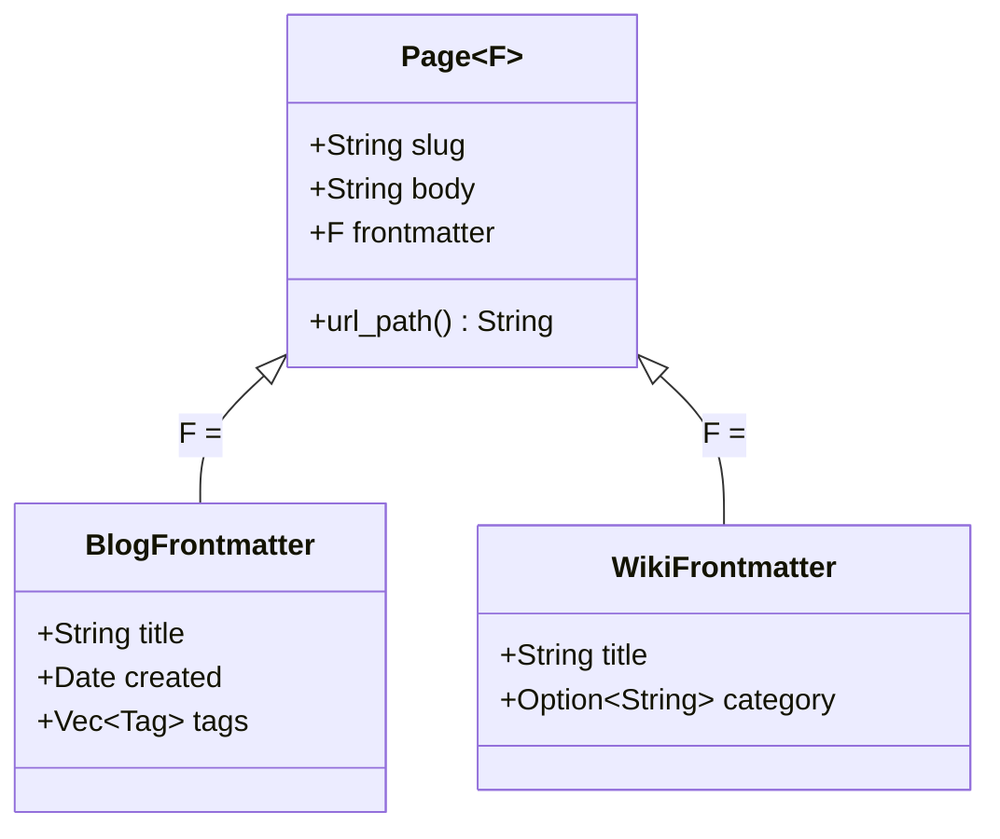
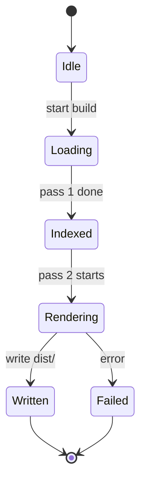
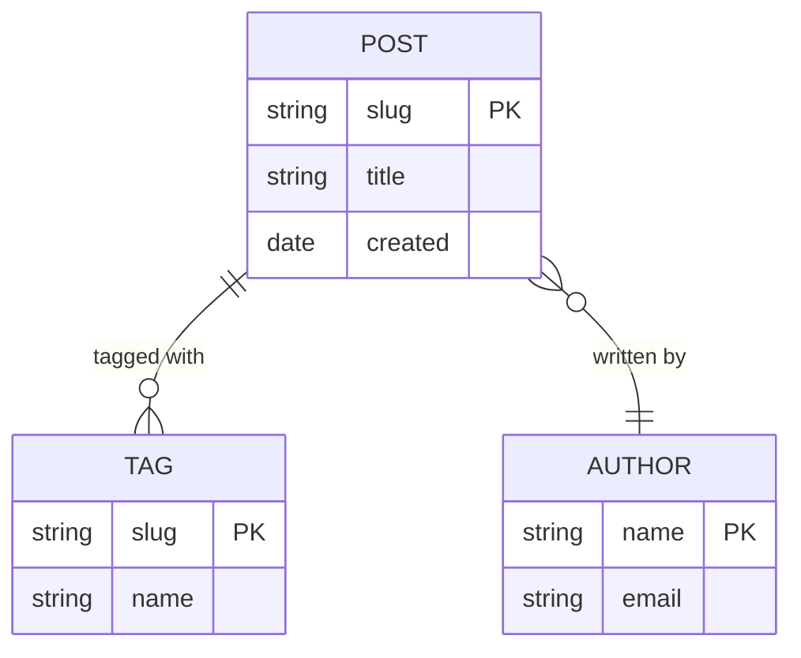
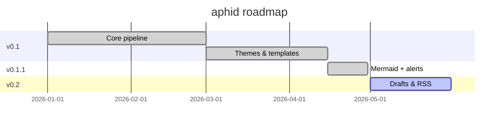
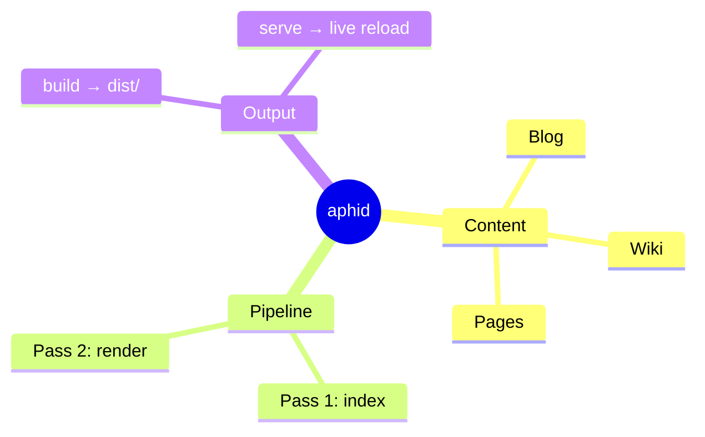

[Mermaid](https://mermaid.js.org/) lets you describe diagrams in plain text and renders them as SVG in the browser. `aphid` recognises fenced code blocks tagged `mermaid` and emits them as `<pre class="mermaid">` elements; the bundled runtime turns them into diagrams once the page loads.

This page is a quick tour of the diagram types you'll reach for most often. For the full catalogue and every option each diagram supports, see the [Mermaid documentation](https://mermaid.js.org/intro/).

> [!NOTE]
> The runtime is loaded on demand: pages without a mermaid block don't include the script. See [[markdown]] for how the build pipeline handles this, and [[themes]] for what `base.html` needs to wire up in a custom theme.

# Flowchart

The most common diagram type — boxes and arrows. The first token after `flowchart` is the direction (`TD` top-down, `LR` left-right, `BT`, `RL`).

````markdown

````


Node shapes (`[]` rectangle, `()` rounded, `{}` diamond, `(())` circle, …) and edge styles (`-->`, `-.->`, `==>`) are documented in the [flowchart syntax reference](https://mermaid.js.org/syntax/flowchart.html).

# Sequence diagram

Useful for protocols, request/response flows, and any time-ordered interaction between actors.

````markdown

````


Arrow forms (`->>` solid, `-->>` dashed, `-)` async) and groupings (`alt`, `loop`, `par`, `note over`) are covered in the [sequence diagram reference](https://mermaid.js.org/syntax/sequenceDiagram.html).

# Class diagram

For data models and type relationships.

````markdown

````


Visibility markers (`+`, `-`, `#`), generics with `~T~`, and relationship arrows (`<|--` inheritance, `*--` composition, `o--` aggregation) are listed in the [class diagram reference](https://mermaid.js.org/syntax/classDiagram.html).

# State diagram

For finite state machines and lifecycle flows.

````markdown

````


Composite states, choice points, and forks/joins are described in the [state diagram reference](https://mermaid.js.org/syntax/stateDiagram.html).

# Entity-relationship diagram

For database schemas and domain models.

````markdown

````


Cardinality markers (`||` exactly one, `o{` zero or more, `|{` one or more) and attribute keys (`PK`, `FK`, `UK`) are detailed in the [ER diagram reference](https://mermaid.js.org/syntax/entityRelationshipDiagram.html).

# Gantt chart

For project timelines and roadmaps.

````markdown

````


Task states (`done`, `active`, `crit`), dependencies via `after taskId`, and milestones with `:milestone,` are in the [Gantt reference](https://mermaid.js.org/syntax/gantt.html).

# Mindmap

Useful for hierarchical brainstorms.

````markdown

````


Node shape syntax matches flowcharts (`(())`, `[]`, `{{}}`, …). See the [mindmap reference](https://mermaid.js.org/syntax/mindmap.html).

# Theming

Diagram colours can be tuned per site by overriding `themeVariables` when calling `mermaid.initialize` in your theme's `base.html` — see [[themes]] for a worked example. The full set of theme variables is documented in the [Mermaid theming guide](https://mermaid.js.org/config/theming.html).

# Other diagram types

Mermaid also supports pie charts, quadrant charts, requirement diagrams, user journeys, gitgraph, C4 diagrams, timelines, sankey charts, XY charts, and block diagrams. They all use the same fenced-block mechanism — just change the first line. The [Mermaid syntax index](https://mermaid.js.org/syntax/) lists them all.

See also: [[markdown]], [[themes]].
